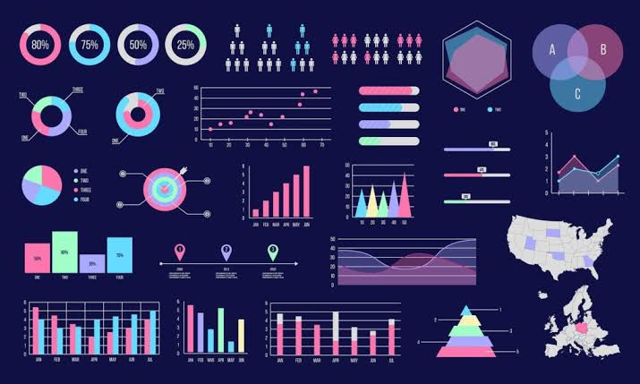

|Name|Age|Gender|
|----|----|----|
|emma|17|male|

 # DTA-240023 Data Visualization

##  **Defination of Data visualization**

Data visualization is the process of creating graphical representations of data to better understand and communicate information. It involves using visual elements like charts, graphs, maps, and interactive dashboards to help people grasp complex data insights. Effective data visualization:

1. _Simplifies complex data_: Makes it easier to understand large datasets and identify patterns, trends, and correlations.
2. _Facilitates exploration_: Enables users to interact with data, explore different perspectives, and uncover hidden insights.
3. _Enhances decision-making_: Supports data-driven decisions by providing clear and actionable information.
4. _Communicates insights_: Helps present data findings in a clear and compelling way, making it easier to share with others.

Data Visualization Tools:

1. *_Tableau_*: A leading data visualization platform for creating interactive dashboards and stories.
2. *_Power BI_*: A business analytics service by Microsoft for data visualization and business intelligence. [download here](https://www.powerbi.com)
3. *_D3.js_*: A JavaScript library for producing dynamic, interactive data visualizations in web browsers. [download here](https://www.D3.Js.com)
4. *_Matplotlib_ and _Seaborn_*: Popular Python libraries for creating static and interactive data visualizations.
5. *_Excel_*: A widely used spreadsheet software with built-in data visualization tools. [download here](https://www.excel.com)

Data Visualization Best Practices:

1. _Keep it simple and clear_: Avoid clutter and focus on key insights.
2. _Choose the right chart type_: Select the appropriate chart to effectively communicate the data story.
3. _Use color effectively_: Utilize color to convey meaning and draw attention to important insights.
4. _Interactivity_: Incorporate interactive elements to enable exploration and discovery.
5. _Storytelling_: Use visualization to tell a story with data, providing context and insights.

Some popular data visualization projects include:

1. _Interactive dashboards_ for monitoring real-time data, like website analytics or sensor readings.
2. _Geospatial visualizations_ for exploring geographic data, such as election results or population density.
3. _Network visualizations_ for representing relationships between entities, like social media connections or supply chains.
4. _Time series visualizations_ for showing trends and patterns in data over time, like stock prices or weather data.
5. _Infographics_ for presenting information in a visually appealing and easily digestible format.

